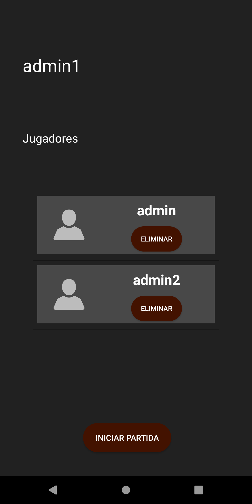

### *UTN-FRBA*
### *Desarrollo de Aplicaciones para Dispositivos Móviles*

# TegMob

## Profesor:
Emanuel Andrada

## Integrantes
| Nombre y apellido | Legajo |
| ---------------- | -------- |
| Abuin, Julieta | 159.050-9 |
| Novoa, Claudio Germán | 155.534-0 |
| Fernández, Guillermo Antonio | 116.320-6 |
| Göttling, Juan | 150.049-1 |
| Boyerman, Miguel |130.938-9 |

----

## Detalles del proyecto

### Descripción
    Se trata de una app que permite jugar al Teg de forma online entre varios jugadores

### Alcance
#### Incluye
- Logueo del usuario
- Creación de partida online
- Adhesión a partida online
- Juego online

##### No incluye
- Creación de partida local
- Juego local

----
## Screenshots

### Home

### New user

### Subhome (logged user)

### New game

### Join game

### Game

### Game demo
